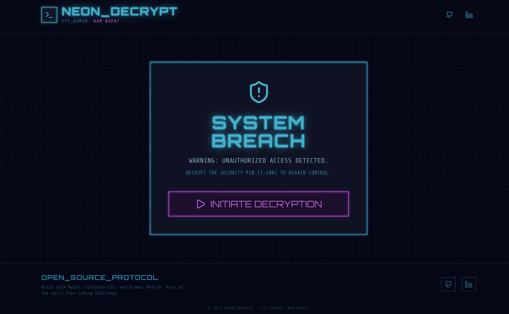
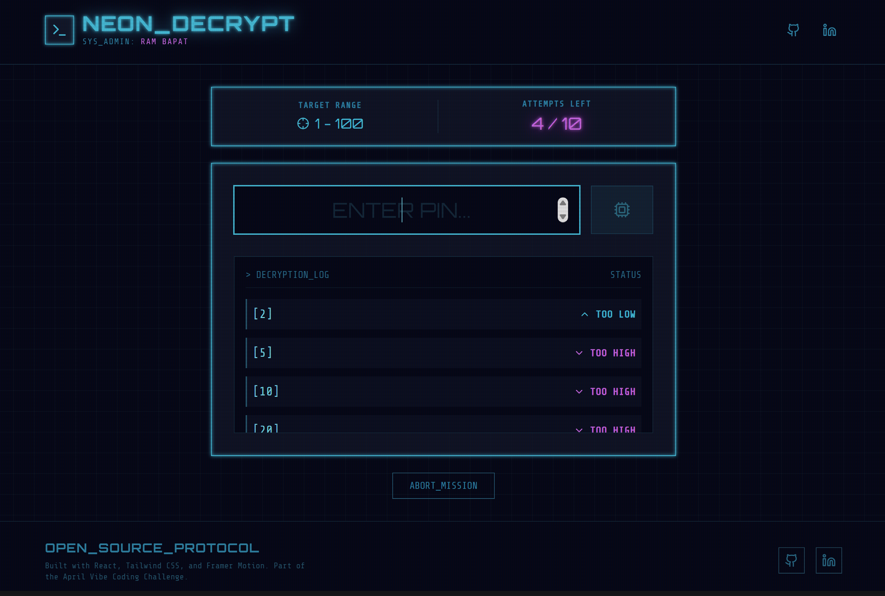
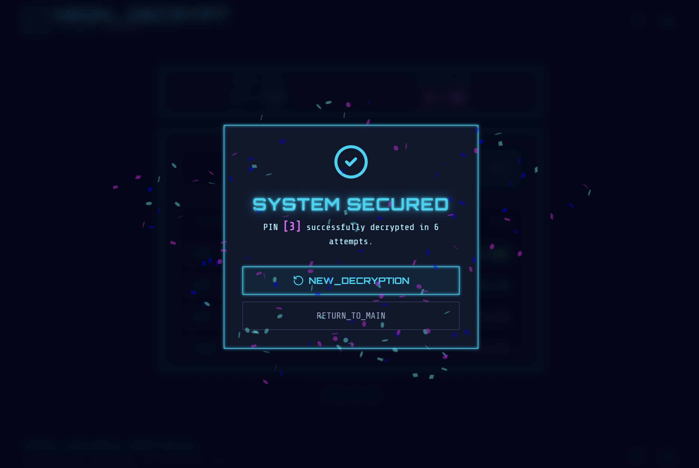

# 🔐 Neon Decrypt: Cyberpunk Number Guesser

    

**Day 08 / 30 - April Vibe Coding Challenge**

## Try the live demo - [Demo](https://neon-decrypt-game.vercel.app/)

**Neon Decrypt** is a high-tech, cyberpunk-themed number guessing game where players must crack a system PIN.

Instead of a basic input form, Neon Decrypt offers an immersive terminal experience. With glowing neon text, scanline overlays, and a detailed decryption log, it elevates a simple logic game into a thrilling hacker simulation.

## Screenshots

 
 
 

## ✨ Features

*   **⚡ Core Game Logic:** The system generates a random PIN (1-100), and you must guess it within 10 attempts.
*   **👁️ Cyberpunk Aesthetic:** A beautifully engineered interface featuring custom neon text shadows, glowing borders, and a retro CRT scanline overlay.
*   **📜 Decryption Log:** A scrollable history of your previous guesses, providing clear "TOO HIGH" or "TOO LOW" feedback.
*   **🚦 Visual Feedback:** The UI reacts to your progress, with warnings flashing red when attempts run low, and a satisfying confetti explosion upon a successful breach.
*   **🎛️ Immersive UI:** Custom fonts (`Orbitron` and `Share Tech Mono`), glitch animations, and terminal-style inputs complete the vibe.

## 🛠️ Tech Stack

*   **Frontend Framework:** React 19 + Vite
*   **Styling:** Tailwind CSS 4 (Custom Cyberpunk implementation)
*   **Animations:** Framer Motion (`motion/react`)
*   **Icons:** Lucide React
*   **Celebration:** Canvas-confetti

## 🚀 Getting Started

Running Neon Decrypt locally is incredibly simple. No backend required!

### 1. Clone the Repository
```bash
git clone https://github.com/Barrsum/Neon-Decrypt-Game.git
cd Neon-Decrypt-Game
```

### 2. Install Dependencies
```bash
npm install
```

### 3. Run the App
```bash
npm run dev
```
The app will launch locally on `http://localhost:3000`. 

## 🛡️ Architecture Insights

*   **State Management:** The game uses React state to track the target number, current guess, attempt count, and a detailed history log of all previous actions.
*   **CSS Effects:** Custom Tailwind utilities (`neon-text`, `neon-border`, `scanlines`) are injected via `index.css` to create the glowing, retro-futuristic look without relying on heavy image assets.

## 👤 Author

**Ram Bapat**
*   [LinkedIn](https://www.linkedin.com/in/ram-bapat-barrsum-diamos)
*   [GitHub](https://github.com/Barrsum)

---
*Part of the April 2026 Vibe Coding Challenge.*
